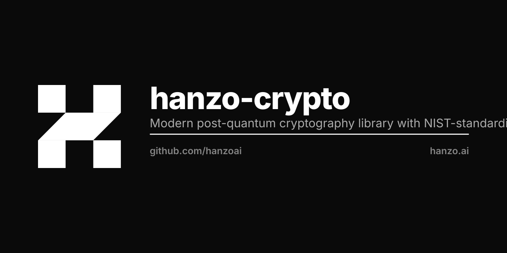

<p align="center"></p>

# Hanzo Crypto

Modern post-quantum cryptography library with NIST-standardized algorithms, optimized for ARM compatibility including Apple Silicon (M1/M2/M3).

## Features

### Post-Quantum Cryptography
- **ML-KEM (FIPS 203)**: Module Lattice Key Encapsulation (formerly Kyber)
  - Pure Rust implementation - no AVX2 assembly issues!
  - ML-KEM-512, ML-KEM-768, ML-KEM-1024
- **ML-DSA (FIPS 204)**: Module Lattice Digital Signatures (formerly Dilithium)
  - Pure Rust implementation
  - ML-DSA-44, ML-DSA-65, ML-DSA-87
- **HQC**: Hamming Quasi-Cyclic code-based cryptography
  - HQC-128, HQC-192, HQC-256

### Symmetric Cryptography
- **BLAKE3**: Fast cryptographic hashing
- **ChaCha20-Poly1305**: Authenticated encryption
- **AES-256-GCM**: Authenticated encryption with associated data
- **Argon2**: Password hashing

### Additional Algorithms
- **X25519**: Elliptic curve key exchange (transitional)
- **Ed25519**: Elliptic curve signatures (transitional)
- **SHA-3**: SHA3-256, SHA3-384, SHA3-512

## Installation

```toml
[dependencies]
hanzo-crypto = "0.1.0"
```

## Quick Start

```rust
use hanzo_crypto::prelude::*;
use hanzo_crypto::{ml_kem, ml_dsa, blake3};

fn main() -> Result<()> {
    // Post-quantum key encapsulation
    use ml_kem::{MlKem768, Encapsulate, Decapsulate};
    let mut rng = rand::thread_rng();
    let (dk, ek) = MlKem768::generate(&mut rng);
    let (ct, ss_sender) = ek.encapsulate(&mut rng)?;
    let ss_receiver = dk.decapsulate(&ct)?;
    assert_eq!(ss_sender, ss_receiver);

    // Post-quantum signatures
    use ml_dsa::{Ml_Dsa65, SigningKey};
    let signing_key = SigningKey::generate(&mut rng)?;
    let message = b"Hello, quantum world!";
    let signature = signing_key.try_sign_with_rng(&mut rng, message)?;
    signing_key.verification_key().verify(message, &signature)?;

    // BLAKE3 hashing
    let hash = blake3::hash(b"Fast hashing with BLAKE3");
    println!("Hash: {}", hash.to_hex());

    Ok(())
}
```

## ARM Compatibility

This library uses pure Rust implementations of ML-KEM and ML-DSA, ensuring full compatibility with ARM processors including Apple Silicon. No AVX2 assembly issues!

## Testing

```bash
# Run all tests
cargo test

# Run examples
cargo run --example basic

# Run benchmarks
cargo bench
```

## Security Levels

- **Level 1**: 128-bit classical security
- **Level 3**: 192-bit classical security (recommended)
- **Level 5**: 256-bit classical security

## License

MIT OR Apache-2.0